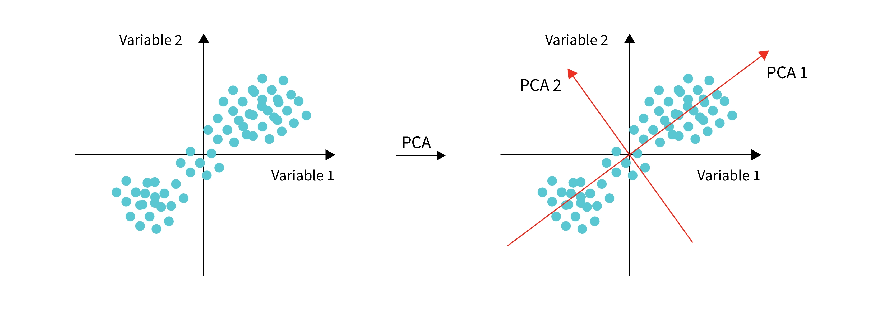

# Principal Component Analysis (PCA)
Principal Component Analysis (PCA) is a dimensionality reduction technique.

## Motivation
The motivation behind PCA is that the dataset for analysis is constrained by the method of data collection. To remove the noise and reveal the hidden structure, PCA becomes important. In mathematics, PCA is to find a new basis, i.e. a set of vectors which linear combination can express all of the collected data, to re-express the dataset. 

## Assumptions
To restrict the set of possible basis, the new basis is assumed to be the linear combination of the original basis. That means a linear transformation is performed to the original dataset. 

To ensure the quality of re-expressed dataset, PCA further assumed that large variance represent the interests. It is reasonable. For example, when we made a measurement e.g. height, there is always some measurement errors. The range height can be between 150 cm and 200 cm, while the errors are between from 1 cm to 3 cm. The measurement of height has larger variance. Hence, when find the new basis, the variance of the measurements should be maximised. The covariance between measurements should also be minimised to reduce the noise. Combining these 2 requirements, the covariance matrix of the transformed data is expected to be diagonal. 

To diagonalise the covariance matrix, PCA assumed all basis vectors are orthonormal. With this assumption, Spectral Theorem can be applied. It states that if $A \in \mathbb{R}^{n \times n}$ is symmetric, there exists an orthonormal matrix $E = \begin{bmatrix} e_{1} & \cdots & e_{n} \end{bmatrix} \in \mathbb{R}^{n \times n}$ such that $$A=E \begin{bmatrix} \lambda_{1} & 0 & \cdots & 0 \\ 0 & \lambda_{2} & \cdots & 0 \\ \vdots & \vdots & \ddots & \vdots \\ 0 & 0 & \cdots & \lambda_{n} \end{bmatrix} E^{T}$$
- $\lambda_{1}, ..., \lambda_{n}$'s are the eigenvalues of $A$ and $e_{1}, ..., e_{n}$ are their corresponding eigenvectors

## Aim
In summary, the goal is to find some orthonormal matrix $P$ in $Y=PX$ such that $C_{Y}=\frac{1}{n}Y Y^{T}$ is a diagonal matrix. 
- $n$ is the number of observations
- $m$ is the number of measurements or features
- $X \in \mathbb{R}^{m \times n}$ is the original dataset where all $m$ measurements are assumed have mean 0 without loss of generality
- $P \in \mathbb{R}^{m \times n}$  is the matrix transforming $X$. The rows of $P$, $\{p_{1}, ..., p_{m}\}$ are a set of new basis vector for expressing the columns of $X$
- $Y \in \mathbb{R}^{m \times n}$ is transformed dataset 
- $C_{Y}$ is the covariance matrix of $Y$

## Justification
The covariance matrix of $X$, $C_{X}$ , is symmetric. By Spectral Theorem, there exists an orthonormal matrix $E$ such that $C_{X}=EDE^{T}$ where $D$ is a diagonal matrix and each column of $E$ is the eigenvectors of $C_X$

Take $P=E^{T}$ i.e. each row of $P$ is the eigenvector of $C_{X}$
Since $E$ is orthonormal matrix, $E^{T} = E^{-1}$. 
$P^{T}P = EE^{T}= I$ and $PP^{T} = E^{T}E = I$, so $P$ is also an orthonormal matrix
$$\begin{align*}
C_{Y} &= \frac{1}{n} Y Y^{T} \\ 
&= \frac{1}{n}(PX)(PX)^{T} \\
&= \frac{1}{n} PXX^{T}P \\
&= P \left(\frac{1}{n} X X^{T}\right) P \\
&= P C_{X} P^{T} \\
&= P (EDE^{T}) P^{T} \\
&= E^{T}  (EDE^{T}) (E^{T})^{T} \\
&= D \hspace{38mm} (\because E^{T} = E^{-1})
\end{align*}$$

After finding $P$, its rows $p_{1}, ..., p_{m}$ can be ordered by its eigenvalues
The ordered set of $\mathbf{p}$'s $\{p_{\tilde{1}}, ..., p_{\tilde{m}}\}$ are the **principal component (PC)**. Each principal component captures a certain amount of variance in the data.
If only using the first few PCs which often capture the majority of the data's variability to express the dataset, the number of measurements in the dataset can reduced while retaining most of original information.

## Geometric Interpretation
* In a two-dimensional scenario, Principal Component Analysis (PCA) involves the rotation of the x and y axes i.e basis vectors, to capture the maximum variability, or variance, in the data.
* The orientation of the rotated axes is determined by the principal components, or eigenvectors, of the covariance matrix derived from the original dataset
* The explained variance is revealed by the eigenvalues associated with the covariance matrix of the original dataset

## Algorithm
To start out, it is important to check whether the features are uncorrelated with each other or not. If not, PCA will not so useful.
1. **Standardization**: Standardize the data by subtracting the mean of each feature from the data points and dividing by the standard deviation. This step ensures that all features have the same scale
2. **Covariance / Correlation Matrix**: Calculate the covariance matrix of the standardized data. The covariance matrix provides information about the relationships between different features. This avoids the case where all your variance will be on only one component because the variance is all on just one or two variables with a bigger scale.
3. **Eigendecomposition**: Find the eigenvalues and eigenvectors of the covariance matrix. The eigenvectors represent the directions (principal components) in which the data varies the most, while the eigenvalues indicate the magnitude of the variance in those directions
4. **Sort and Select Components**: Sort the eigenvalues in descending order and choose the top k eigenvectors corresponding to the k largest eigenvalues. These k eigenvectors form the basis for the new subspace
5. **Projection**: Project the original data onto the new subspace formed by the selected eigenvectors. This results in a lower-dimensional representation of the data